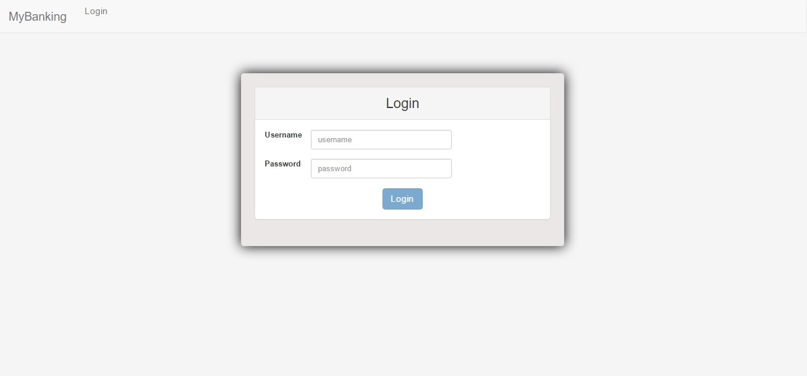
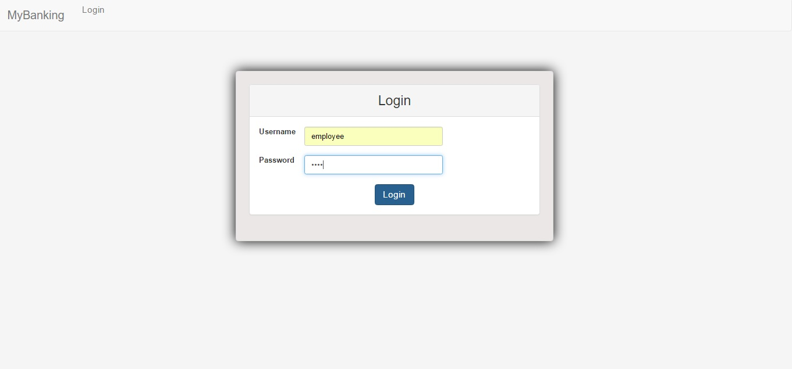
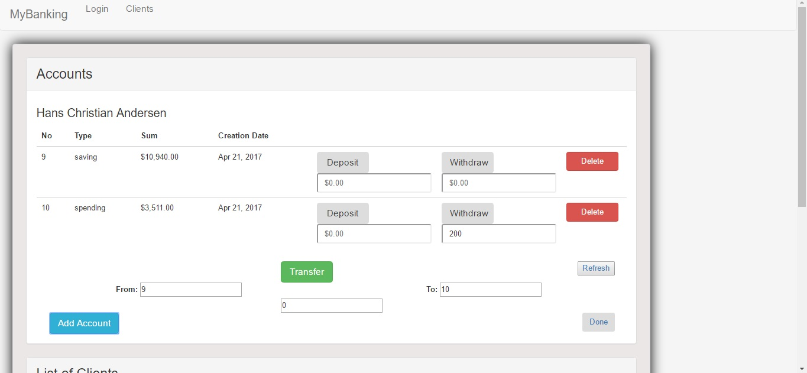
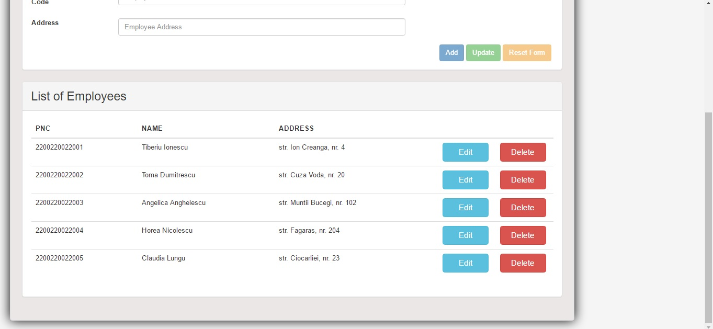

# springboot-angular-CRUD
Spring Boot - Angular - Hibernate - Maven - CRUD application

Installation steps:

1. install java- JDK 1.7 or above
	https://java.com/en/download/
	
2. download and install the Eclipse IDE for Java EE Developers
	https://www.eclipse.org/downloads/packages/eclipse-ide-java-ee-developers/neon3
	
3. install maven- download the binary distribution:
	https://maven.apache.org/download.cgi
	
	3.1. unzip the archive:
	
		Unix-based operating systems (Linux, Solaris and Mac OS X)
			tar zxvf apache-maven-3.x.y.tar.gz
		Windows
			unzip apache-maven-3.x.y.zip

	3.2. A directory called "apache-maven-3.x.y" will be created.

	3.3. Add the bin directory to your PATH, eg:
	
		Unix-based operating systems (Linux, Solaris and Mac OS X)
		  export PATH=/usr/local/apache-maven-3.x.y/bin:$PATH
		Windows
		  set PATH="c:\program files\apache-maven-3.x.y\bin";%PATH%

	3.4. Make sure JAVA_HOME is set to the location of your JDK

	3.5. Run "mvn --version" to verify that it is correctly installed.
	
4. M2E plugin for Eclipse
	install the latest M2Eclipse release by using the following update site from within Eclipse:
	http://download.eclipse.org/technology/m2e/releases
	
Accessing application:
● Employee View: 

	--username: employee
	--password: empl
	
● Admin View:

	--username: admin
	--password: adm

Use cases screenshots:

Login:
 

Login-employee:
 

Login-admin:

 
	Loged in as employee:

Employee page:
 
 

Adding Client-CNP exists:
 

Adding Client (same details, correct CNP):

 
Delete Client (Teodora Barbulescu):
-	before

 
-	after

 

Update Client (Andreescu Silviu):
 

Reset Form:
 

Select Client Accounts (Hans Chr. Andersen):
 

Deposit in account 
-	initially:

-	after Refresh:
 

Withdraw from Account:
-	initially:

-	after Refresh:
 

Transfer between accounts:

after Refresh:
 

Add Client Account:

after Refresh:
 

Delete Client Account:
 

after Refresh:

 

	Logged in as admin:

Admin page:
 
 

Add Employee:
 
 
 
Add Employee with existing CNP:
 
 
Delete Employee (Maria Nicoara):
-	before:

-	after:

Update Employee:
 
 
